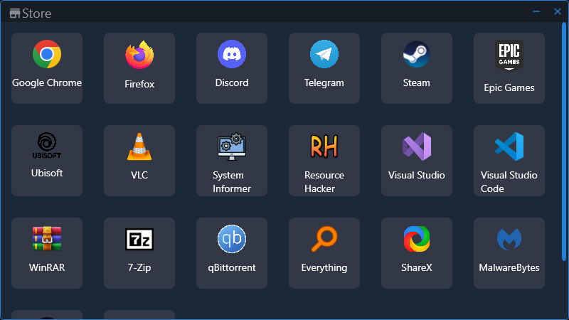

## Mini Store
 

## Функционал
* Скачивание и запуск установищков
* Быстрая замена ссылок
* Очистка установщиков
* Поддержка автора

## Установка
Скачайте релиз или соберите сами

## Замена ссылок
Файл со всеми ссылками Data.json, также можно добавлять ссылки прямиков в программе на кнопку "+"

## От автора
Надеюсь мой проект будут поддерживать

---
# English
**Translated using Google translator**

## Functionality
* Downloading and launching installers
* Quick replacement of links
* Cleanup installers
* Author support

## Installation
Download the release or build it yourself

## Replacing links
A file with all Data.json links, you can also add direct links in the program to the “+” button

## From the author
I hope my project will be supported
